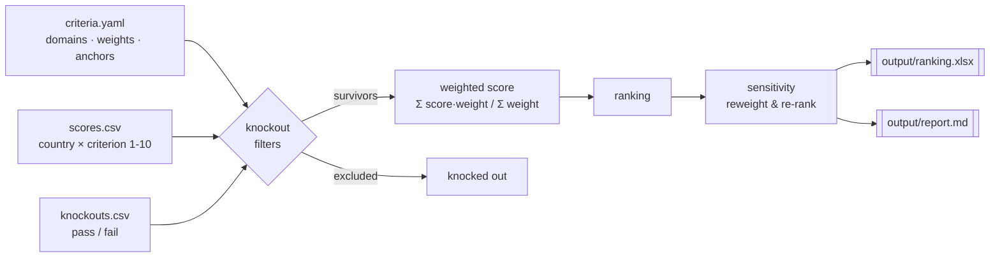

# relocation-decision-model

[](https://github.com/smbochkarev1/relocation-decision-model/actions/workflows/tests.yml)
&nbsp;
&nbsp;

A small, configurable framework for choosing **where to relocate** with weighted
multi-criteria scoring instead of gut feeling. You define the criteria that matter
to *you*, weight them, score each candidate country 1–10, and the engine ranks
them and stress-tests the result. Bring your own situation — nothing here is
hard-coded to one person.

---

## 1. Problem

Picking a country to move to is high-stakes and emotional. Favorites ("I've always
loved Portugal") crowd out the boring factors that actually determine whether a
move works — visa reality, taxes on your income, healthcare, how far it is from
home. This repo turns that decision into an explicit, auditable model: every
factor is named, weighted, and scored on the same 1–10 scale, so the ranking is
reproducible and you can see *why* one country beats another — and where the answer
flips if your priorities change.

## 2. How it works



1. **Knockout filters** run first — a country that fails a hard requirement (no
   visa route, active conflict, unreachable) is dropped before it wastes any
   scoring effort.
2. **Weighted score** for every survivor: `Σ(score × weight) / Σ(weight)`,
   producing a 0–10 number.
3. **Ranking** across all candidates.
4. **Sensitivity analysis** re-runs the ranking under alternative weight presets
   ("visa-first", "money-first", "safety-first", …) to show how robust the leader
   is.
5. Outputs an **Excel workbook** (interactive: edit the weight row, totals
   recompute) and a **Markdown report**.

## 3. Example result

The included example (`examples/eu-relocation-couple/`) is the author's own
decision — a couple, one restricting passport, Mediterranean climate preferred,
$4–5k/month, 36 candidate countries, 24 criteria. Marked as **example input**, not
advice. Running `python score.py --config examples/eu-relocation-couple`
reproduces:

| # | Country | Score | Note |
|---|---------|-------|------|
| 1 | **Georgia** | **6.66** | Best visa access, cost, taxes — but worst geopolitical-risk score (C6=2) |
| 2 | **Portugal** | **6.56** | NATO, stable democracy, best climate in the sample |
| 3 | Spain | 6.55 | Effectively tied with Portugal (0.01 apart) |
| 4 | Turkey | 6.44 | Mediterranean climate, strong job market, NATO |
| 5 | UAE | 6.30 | Zero tax, strong labor market; no PR path, harsh climate |

**Insight:** the leader is *not* robust the way the raw number suggests. Georgia
wins the baseline by 0.10, and Georgia + Portugal stay in the top 5 under every
weighting — but the moment you switch to the **safety-first** preset, Georgia falls
out of the top and NATO members (Portugal, Spain) lead. Portugal and Spain are a
coin-flip (0.01). The model's real output isn't "go to Georgia" — it's "your
answer depends entirely on how much you weight geopolitical risk, so decide that
first." Full write-up: [`examples/eu-relocation-couple/output/report.md`](examples/eu-relocation-couple/output/report.md).

## 4. Quickstart

Requires Python 3.9+.

```bash
pip install -r requirements.txt
```

**Path A — edit the config yourself**

1. Edit [`config/criteria.yaml`](config/criteria.yaml): your profile, domains,
   criteria, weights (sum to 100), anchors, and knockout filters.
2. Fill [`config/scores.csv`](config/scores.csv): one row per country, score each
   criterion 1–10 (10 = best for you). Optionally add `knockouts.csv`.
3. Run it:
   ```bash
   python score.py
   ```
   Outputs land in `config/output/` (`ranking.xlsx`, `report.md`).

**Path B — let Claude do it**

Give this repo to [Claude Code](https://claude.com/claude-code) (or paste
[`PROMPT_FOR_CLAUDE.md`](PROMPT_FOR_CLAUDE.md)) and say:

> *Set up a relocation model for my situation.*

Claude interviews you about your circumstances and priorities, writes
`criteria.yaml`, helps you find and fill in `scores.csv` from the data sources
below, then runs `score.py`. This is the intended "hand the repo to your AI" flow.

To re-run the bundled example instead of your own config:

```bash
python score.py --config examples/eu-relocation-couple
```

## 5. Design decisions

- **Explicit weights that sum to 100.** Forcing a 100-point budget makes trade-offs
  visible: giving visa access 10 points means something is losing those points.
  The engine normalizes by the weight sum, so any total works, but 100 keeps the
  numbers legible.
- **1–10 scale with written anchors.** Every criterion defines what a 1–3, 4–6 and
  7–10 mean (e.g. climate 10 = Mediterranean, 4 = humid tropics). Anchors make a
  score reproducible and defensible instead of "felt like a 7". Inverted metrics
  (cost, distance, density) are scored so 10 is always best.
- **Knockout filters before scoring.** Some requirements are pass/fail, not
  weighable — no legal visa route can't be "made up for" by great food. Filtering
  first keeps the scored set realistic and the ranking honest.
- **Sensitivity analysis is the point, not a footnote.** A single ranking hides how
  fragile it is. Re-ranking under "visa-first / money-first / safety-first" presets
  reveals whether your leader is a genuine winner or an artifact of one weight
  choice — which is usually the most decision-relevant thing you learn.
- **Config/engine separation.** `score.py` knows nothing about countries or the
  author. Everything personal lives in the config files, so the same engine serves
  any user and any situation.

## 6. Data sources

Where to pull raw numbers when filling `scores.csv`. Score each on 1–10 relative to
your own candidate set and priorities.

| Criteria | Source |
|----------|--------|
| Visa / residence / PR | Official immigration portals; Global Citizen Solutions; Citizen Remote |
| Cost of living, rent | [Numbeo](https://www.numbeo.com), Expatistan |
| Taxes on income | [PwC Worldwide Tax Summaries](https://taxsummaries.pwc.com); local tax authority |
| Personal safety | [Global Peace Index](https://www.visionofhumanity.org), Numbeo Safety Index |
| Healthcare | WHO; Numbeo Health Index |
| Climate, air quality | Climate normals; Numbeo Climate Index; [IQAir](https://www.iqair.com) |
| Political stability | World Bank Governance Indicators; [EIU Democracy Index](https://www.eiu.com); [Freedom House](https://freedomhouse.org) |
| Geopolitical risk | NATO/CSTO membership; conflict history; public risk analysis |
| Cultural closeness | [World Values Survey](https://www.worldvaluessurvey.org) / Inglehart–Welzel map |
| Language | [EF English Proficiency Index](https://www.ef.com/epi) |
| Travel distance | [Rome2rio](https://www.rome2rio.com) |

## 7. Tests

The scoring core is covered by a pytest suite (`tests/test_scoring.py`) that pins
each function to a known answer — weighted-average normalization, the zero-weight
guard, score-descending order with alphabetical tie-breaks, and 2-dp rounding —
plus an integration test that loads and ranks the bundled example config. It runs
offline with no network or credentials, and in CI on every push (see the badge above).

```bash
pip install -r requirements.txt pytest
pytest -q
```

## 8. Limitations

- **Garbage in, garbage out.** The engine is honest arithmetic over *your* 1–10
  scores; a biased or lazily-filled `scores.csv` produces a confident wrong ranking.
  The written anchors exist to fight this, not eliminate it.
- **Not immigration advice.** Visa rules change and can be affected by sanctions —
  the model ranks options, it doesn't confirm you qualify. Verify with a lawyer.
- **Relative, single-decision-maker scoring.** Scores are relative to *your*
  candidate set and priorities; two people will weight and score differently, and
  that's expected. There's no "objective" country ranking here.
- **Sensitivity ≠ certainty.** Reweighting presets show how fragile a leader is;
  they don't tell you which weighting is *correct* — that judgement stays yours.

## Repository layout

```
relocation-decision-model/
├── score.py                     # generic scoring engine (no personal data)
├── requirements.txt             # pyyaml, openpyxl
├── config/                      # YOUR model — a blank, commented template
│   ├── criteria.yaml            #   profile · knockouts · domains/criteria/weights/anchors · presets
│   └── scores.csv               #   country × criterion matrix (1–10)
├── examples/
│   └── eu-relocation-couple/    # author's own case, kept as example input
│       ├── criteria.yaml        #   24 criteria, 7 domains, 5 sensitivity presets
│       ├── scores.csv           #   36 countries, normalized 1–10 scores
│       ├── knockouts.csv        #   demonstrates a filtered-out candidate
│       └── output/              #   generated ranking.xlsx + report.md
├── PROMPT_FOR_CLAUDE.md         # interview script for the "hand it to Claude" flow
└── LICENSE                      # MIT
```

---

*Not immigration advice. Visa rules for any given passport change frequently and
can be affected by sanctions — confirm with an immigration lawyer before deciding.*
MIT © 2026 Sergei Bochkarev.
